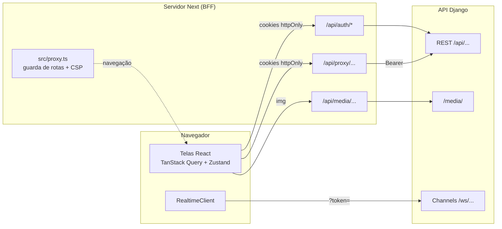
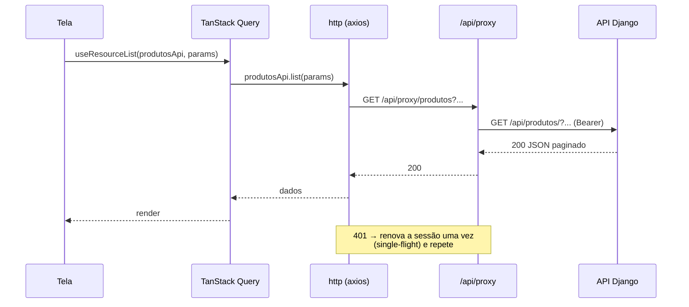

# Arquitetura

O painel é uma aplicação **Next.js 16 (App Router)** que nunca fala com a API Django direto do navegador. Todas as chamadas passam por rotas do próprio Next (o **BFF**, _backend for frontend_), que guardam os tokens em cookies httpOnly e repassam as requisições à API.

## Stack

| Camada            | Tecnologia                                                      |
| ----------------- | --------------------------------------------------------------- |
| Framework         | Next.js 16 (App Router, Turbopack), React 19, TypeScript strict |
| Estilo e UI       | TailwindCSS 4, componentes no padrão shadcn/ui (Radix), lucide  |
| Dados do servidor | TanStack Query 5 (cache, invalidação, retentativas)             |
| Estado local      | Zustand 5 (usuário, filial selecionada, tempo real, UI)         |
| Formulários       | React Hook Form + Zod 4                                         |
| HTTP              | axios no navegador, `fetch` no servidor                         |
| Tempo real        | WebSocket nativo (Django Channels), cliente próprio             |
| i18n              | next-intl, idioma único pt-BR                                   |
| Gráficos          | Recharts                                                        |
| Testes            | Vitest + Testing Library (unidade), Playwright (E2E)            |
| Qualidade         | ESLint (typescript-eslint strict, SonarJS, jsx-a11y), SonarQube |

> **Atenção:** o Next 16 tem mudanças de API em relação às versões anteriores. O antigo `middleware.ts` agora é `src/proxy.ts`, e APIs como `cookies()` e `params` são assíncronas. Antes de escrever código do Next, consulte `node_modules/next/dist/docs/` (regra do `AGENTS.md`).

## Visão geral



- **Páginas:** o `proxy.ts` roda antes de cada página. Ele renova o token se preciso, redireciona quem não está logado e barra rotas que o perfil não pode abrir.
- **Dados:** o navegador chama `/api/proxy/<recurso>`. O BFF troca o cookie pelo cabeçalho `Authorization: Bearer` e encaminha para `API_URL/api/<recurso>/`.
- **Tempo real:** o navegador abre o WebSocket direto na API, com um access token de vida curta pedido em `/api/auth/ws-token`. Cada evento invalida as consultas afetadas no TanStack Query.

Os detalhes de cada parte estão em [Autenticação e segurança](autenticacao-e-seguranca.md) e [Tempo real](tempo-real.md).

## Estrutura de pastas

```
src/
  app/                        rotas do App Router
    layout.tsx                HTML raiz, provedores globais, nonce da CSP
    (auth)/login/             tela de login (sem layout do painel)
    (painel)/                 área autenticada (layout com sidebar e topo)
      page.tsx                dashboard
      pedidos/ separacao/ produtos/ estoque/ clientes/
      relatorios/ formas-pagamento/ promocoes/ configuracoes/
      acesso-negado/          destino do proxy quando o perfil não pode abrir a rota
      error.tsx loading.tsx   estados de erro e carregamento da área logada
    api/                      BFF (route handlers, só servidor)
      auth/login|refresh|logout|ws-token
      proxy/[...path]         proxy autenticado para a API
      media/[...path]         fotos de produto pela mesma origem
  components/
    ui/                       primitivos (button, dialog, table, tabs...) no padrão shadcn/ui
    layout/                   app-shell, sidebar, menu do usuário, seletor de filial, tema
    shared/                   DataTable, FormField, Can, Combobox, RemoteCombobox, LojaField...
    providers/                tema, TanStack Query, sessão, tempo real
  features/<modulo>/          um módulo por domínio (pedidos, produtos, separacao...)
    components/               telas e diálogos do módulo
    schemas.ts                validação Zod dos formulários
    *.ts                      regras puras e testáveis (actions, csv, estoque, checklist...)
  services/                   acesso à API pelo navegador
    http/client.ts            axios + renovação única de sessão
    http/errors.ts            normalização dos erros do DRF
    resource.ts               CRUD genérico de um ViewSet
    api.ts                    serviços por recurso (produtosApi, pedidosApi...)
  store/                      Zustand: auth, filial, tempo real, UI
  hooks/                      usePermission, useResourceList, useApiMutation...
  lib/                        utilidades puras (sessão JWT, formatação, GTIN, telefone...)
    realtime/                 cliente WebSocket
    server/                   código só do servidor (cookies, env, chamadas à API, CSRF)
  config/                     env, endpoints, permissões, navegação, UFs
  i18n/ messages/             next-intl e textos em pt-BR
  types/                      tipos da API, sessão, eventos de tempo real
  proxy.ts                    guarda de rotas + CSP (o antigo middleware)
tests/
  unit/                       Vitest
  e2e/                        Playwright contra a API real
docs/                         esta documentação
```

### Regras de dependência

- `src/lib/server/**` importa `server-only`: o build falha se algo do navegador tentar usá-lo. É ali que ficam `API_URL`, cookies e chamadas diretas à API.
- `features/*` podem usar `components/`, `services/`, `lib/`, `hooks/` e `store/`. Uma feature só importa de outra quando a regra é compartilhada de verdade (ex.: `separacao` usa as ações de `pedidos`).
- Regras de negócio ficam em arquivos `.ts` puros dentro da feature (`actions.ts`, `checklist.ts`, `estoque.ts`, `csv.ts`...). Eles são testados por unidade; os componentes só chamam essas funções.

## Fluxo de dados no navegador



- **Leitura:** `useResourceList(servico, params)` (em `src/hooks/use-resource.ts`) monta a chave com `queryKeys.list(servico.name, params)`.
- **Escrita:** `useSaveResource`, `useDeleteResource` e `useApiMutation` invalidam os domínios afetados, mostram um toast e repassam os erros de campo do DRF para o formulário (`applyFieldErrors`).
- **Chaves de cache:** o primeiro elemento de cada chave é o domínio (`"produtos"`, `"pedidos"`, `"relatorios"`...). Isso permite invalidar tudo de um recurso com `invalidateQueries({ queryKey: [dominio] })`, como faz o tempo real.
- **Padrões do QueryClient** (`src/components/providers/query-provider.tsx`):
  - `staleTime` de 30 s, porque as atualizações chegam pelo WebSocket;
  - erros 4xx não são repetidos;
  - os demais erros têm até 2 retentativas;
  - mutações nunca são repetidas.

## Estado global (Zustand)

| Store            | Conteúdo                                     | Persistido             |
| ---------------- | -------------------------------------------- | ---------------------- |
| `auth-store`     | usuário da sessão (claims do access token)   | não                    |
| `filial-store`   | filial escolhida pelo ADMIN no topo          | sim (`sb-filial`)      |
| `realtime-store` | status da conexão e horário do último evento | não                    |
| `ui-store`       | sidebar recolhida, menu mobile aberto        | só a sidebar (`sb-ui`) |

`resolveLojaId(user, selecionada)` define a filial efetiva:

- funcionários ficam sempre na própria filial;
- o ADMIN usa a filial escolhida no topo;
- sem nenhuma escolha, o ADMIN vê todas as filiais (`null`).

## Renderização

- O layout `(painel)/layout.tsx` é um Server Component. Ele lê a sessão do cookie (`getServerSession`) e entrega o usuário ao `AuthProvider`, que hidrata o store antes do primeiro render, sem uma requisição extra.
- As telas são Client Components (`"use client"`) que buscam dados com TanStack Query.
- O `proxy.ts` gera um **nonce** por requisição. O layout raiz repassa esse nonce aos scripts inline, como o do `next-themes`.
- `next.config.ts` usa `output: "standalone"` para a imagem Docker de produção.

## Decisões de projeto

| Decisão                                            | Motivo                                                                                                            |
| -------------------------------------------------- | ----------------------------------------------------------------------------------------------------------------- |
| BFF com cookies httpOnly                           | O token nunca fica acessível ao JavaScript da página, o que protege contra roubo de sessão por XSS.               |
| Renovação de sessão "single-flight"                | A API rotaciona o refresh e coloca o anterior na blacklist; dois refreshes paralelos deslogariam o usuário.       |
| Fotos pela rota `/api/media`                       | A imagem vem da mesma origem: a CSP não precisa liberar o host da API, e trocar a URL da API é só mudar o `.env`. |
| Selects de dados remotos controlados (`LojaField`) | Com `register`, o valor era aplicado antes das opções chegarem e o navegador o descartava.                        |
| URLs só em variáveis de ambiente                   | Trocar desenvolvimento por produção é mudar o `.env`; nenhum arquivo de código tem URL ou IP (regra Sonar S1313). |
| Matriz de permissões no painel                     | Serve apenas para esconder o que o perfil não usa. **A API continua sendo a autoridade final.**                   |
