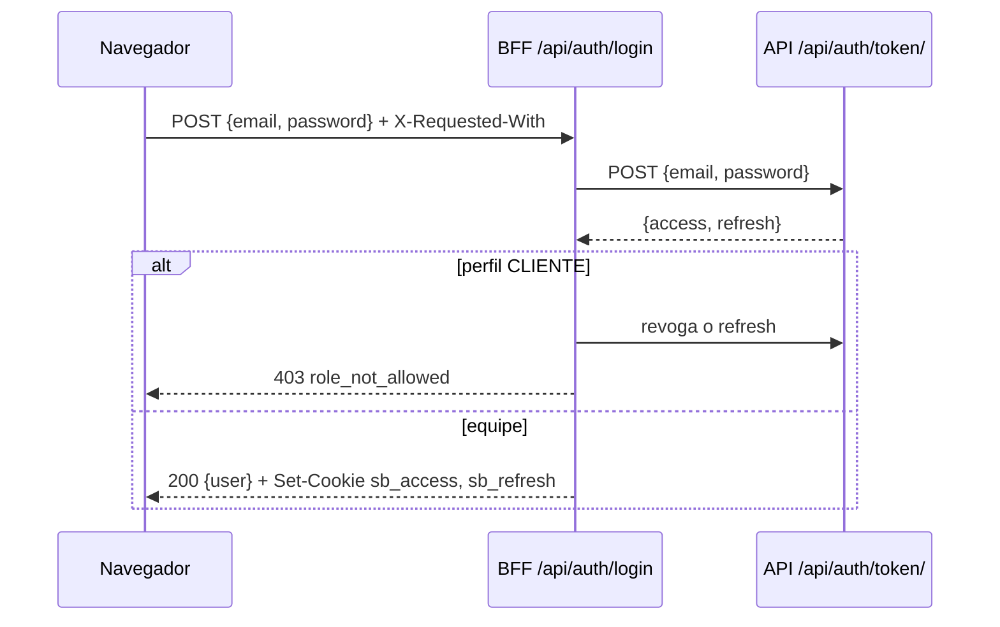

# Autenticação e segurança

## Resumo

- A API usa JWT (SimpleJWT). O **access token dura 15 minutos**. O refresh é **rotacionado** a cada uso, e o anterior vai para a blacklist.
- O painel guarda os dois tokens **somente** em cookies `httpOnly`. O JavaScript da página nunca os lê. A única exceção controlada é o token entregue ao WebSocket (veja [abaixo](#token-do-websocket)).
- O perfil `CLIENTE` tem conta na API, mas não entra no painel.

## Cookies

Definidos em `src/lib/server/auth-cookies.ts`.

| Cookie       | Conteúdo      | Atributos                                                  | Validade                   |
| ------------ | ------------- | ---------------------------------------------------------- | -------------------------- |
| `sb_access`  | access token  | `httpOnly`, `SameSite=Lax`, `Path=/`, `Secure` em produção | igual à expiração do token |
| `sb_refresh` | refresh token | idem                                                       | igual à expiração do token |

`Secure` depende de `NEXT_PUBLIC_APP_ENV=production`. Em desenvolvimento (HTTP), o cookie precisa ir sem `Secure`.

## Rotas do BFF

| Rota                   | Método | O que faz                                                                                     |
| ---------------------- | ------ | --------------------------------------------------------------------------------------------- |
| `/api/auth/login`      | POST   | Valida e-mail/senha com Zod, pede o par de tokens à API, recusa `CLIENTE` e grava os cookies. |
| `/api/auth/refresh`    | POST   | Troca o refresh do cookie por um par novo. Se falhar, apaga os cookies e responde 401.        |
| `/api/auth/logout`     | POST   | Coloca o refresh na blacklist da API (melhor esforço) e apaga os cookies.                     |
| `/api/auth/ws-token`   | GET    | Devolve o access token atual para abrir o WebSocket (`Cache-Control: no-store`).              |
| `/api/proxy/[...path]` | todos  | Encaminha para `API_URL/api/<path>/` com `Authorization: Bearer <access>`.                    |
| `/api/media/[...path]` | GET    | Serve fotos de `API_URL/media/...` pela mesma origem.                                         |

### Login

Mensagens mostradas no formulário de login:

| Resposta | Mensagem                                    |
| -------- | ------------------------------------------- |
| 400, 401 | E-mail ou senha incorretos.                 |
| 403      | Seu perfil não tem acesso ao painel.        |
| 429      | Muitas tentativas (limite de login da API). |
| outras   | Não foi possível falar com a API.           |

Depois do login, o usuário volta para `?next=` (só caminhos internos, validados por `safeNextPath`) ou para o dashboard.

### Renovação do access token

Há dois pontos de renovação, um para cada tipo de acesso:

1. **Navegação entre páginas:** o `src/proxy.ts` decodifica o access do cookie. Se ele expirou, renova com o refresh **antes** de renderizar e grava os cookies novos na resposta e na própria requisição (os Server Components já recebem o token novo).
2. **Chamadas de dados:** o interceptor do axios (`src/services/http/client.ts`) recebe um 401, chama `/api/auth/refresh` e repete a requisição **uma vez**.

A renovação no navegador usa `singleFlight` (`src/lib/single-flight.ts`): se várias requisições receberem 401 ao mesmo tempo, todas esperam **a mesma** renovação. Sem isso, a segunda renovação usaria um refresh já na blacklist e o usuário seria deslogado.

Se a renovação falhar, o `AuthProvider` limpa o estado e manda para `/login?expired=1`, que mostra "Sua sessão expirou".

### Logout

`src/components/layout/user-menu.tsx` faz três passos, nesta ordem:

1. cancela as consultas em andamento;
2. chama `/api/auth/logout`;
3. faz uma navegação completa para `/login`.

A navegação completa descarta o cache, o WebSocket e o estado em memória de uma vez. Antes disso, limpar o cache com a tela montada fazia as consultas ativas buscarem de novo, já sem sessão (vários 401).

### Token do WebSocket

A API exige o access token na URL do WebSocket (`?token=`), e o navegador não lê cookies httpOnly. Por isso existe `/api/auth/ws-token`, que entrega o access token ao JavaScript do **próprio painel**. É uma troca consciente:

- o token tem vida curta (15 min) e não é persistido;
- a rota só responde com sessão válida e `Cache-Control: no-store`;
- em produção, use `wss://` para o token trafegar criptografado.

Essa rota aparece como _Security Hotspot_ esperado no SonarQube.

## Proteção contra CSRF

Os cookies vão automaticamente em qualquer requisição ao painel, então as rotas do BFF que alteram dados verificam a origem (`src/lib/server/csrf.ts`):

1. métodos seguros (`GET`, `HEAD`, `OPTIONS`) passam;
2. se houver `Origin`, ele precisa ser igual à origem do painel;
3. é obrigatório o cabeçalho `X-Requested-With: XMLHttpRequest`. Um formulário de outro site não consegue enviá-lo sem passar pelo CORS.

O cliente axios já envia esse cabeçalho. Chamadas manuais com `fetch` que alterem dados precisam enviá-lo também.

Além disso, `SameSite=Lax` impede que os cookies acompanhem POSTs vindos de outros sites.

## Guarda de rotas

`src/proxy.ts` roda em todas as páginas (exceto `/api`, `_next` e arquivos estáticos):

| Situação                         | Resultado                             |
| -------------------------------- | ------------------------------------- |
| sem sessão, em página protegida  | redireciona para `/login?next=<rota>` |
| com sessão, em `/login`          | redireciona para `/`                  |
| perfil sem permissão para a rota | redireciona para `/acesso-negado`     |
| refresh inválido                 | apaga os cookies                      |

O layout `(painel)/layout.tsx` confere a sessão de novo no servidor, como segunda camada. A sidebar e o componente `<Can>` escondem o que o perfil não usa, mas **quem decide de verdade é a API**: um botão escondido não substitui a permissão no backend.

## Proxy para a API

`src/app/api/proxy/[...path]/route.ts`:

- aceita só segmentos simples (`^[\w-]+$`), o que impede `..` (path traversal) e URLs arbitrárias;
- recusa corpos acima de **5 MB** (o mesmo limite do Nginx da API);
- encaminha o corpo como bytes, o que preserva uploads multipart;
- repassa à resposta apenas `content-type`, `content-disposition` e `retry-after`, sempre com `Cache-Control: no-store`;
- responde 503 se a API não responder (timeout de 15 s).

## Fotos de produto

`src/app/api/media/[...path]/route.ts` não é um proxy aberto:

- exige cookie de sessão;
- aceita só pastas simples e arquivos `.webp`, `.png`, `.jpg` ou `.jpeg`;
- só devolve respostas `image/*` da API;
- envia `X-Content-Type-Options: nosniff` e cache privado de 1 dia (o nome do arquivo muda a cada envio).

`src/lib/media.ts` (`mediaSrc`) converte a URL absoluta que a API devolve (`http://api/media/produtos/x.webp`) para `/api/media/produtos/x.webp`.

## Cabeçalhos de segurança

### Content-Security-Policy (por requisição, em `src/proxy.ts`)

| Diretiva          | Valor                                                                                   |
| ----------------- | --------------------------------------------------------------------------------------- |
| `default-src`     | `'self'`                                                                                |
| `script-src`      | `'self' 'nonce-<aleatório>' 'strict-dynamic'` (+ `'unsafe-eval'` só em desenvolvimento) |
| `style-src`       | `'self' 'unsafe-inline'` (Recharts e Radix usam o atributo `style`)                     |
| `img-src`         | `'self' blob: data:`                                                                    |
| `connect-src`     | `'self'`, a origem de `NEXT_PUBLIC_WS_URL` e o ViaCEP (+ `ws:` só em desenvolvimento)   |
| `object-src`      | `'none'`                                                                                |
| `frame-ancestors` | `'none'`                                                                                |
| outros            | `base-uri 'self'`, `form-action 'self'` e `upgrade-insecure-requests` em produção       |

O `ws:` em desenvolvimento libera extensões do editor (ex.: Console Ninja), que abrem WebSockets locais em portas aleatórias.

### Cabeçalhos fixos (`next.config.ts`)

`X-Frame-Options: DENY`, `X-Content-Type-Options: nosniff`, `Referrer-Policy: strict-origin-when-cross-origin`, `Permissions-Policy` (câmera, microfone, geolocalização e pagamento desligados), `Cross-Origin-Opener-Policy: same-origin` e, em produção, `Strict-Transport-Security` com 2 anos e `preload`. O cabeçalho `X-Powered-By` é removido.

## "Salvar senha neste navegador"

A opção da tela de login (`src/features/auth/lembrar-login.ts`) **não guarda a senha no painel**:

- A senha vai para o gerenciador de senhas do próprio navegador. No Chrome e no Edge, isso acontece pela Credential Management API (`PasswordCredential`); nos demais, o próprio navegador oferece salvar.
- O painel guarda só o e-mail no `localStorage` (`sb_login_email`), para preencher o campo no próximo acesso.
- Desmarcar a opção e entrar apaga o e-mail guardado.

## Segredos

- O painel **não** recebe segredos do backend (`SECRET_KEY`, banco etc.). As variáveis dele são só URLs e o ambiente.
- Credenciais dos testes E2E ficam em `.env.test.local`, que não é versionado.
- O `.gitignore` ignora `.env`, `.env.local`, `.env.*.local` (inclui `.env.test.local`), `.env.development` e `.env.production`; só os `.example` são versionados. O `.dockerignore` ignora todos os `.env*`, exceto o `.env.example`.
