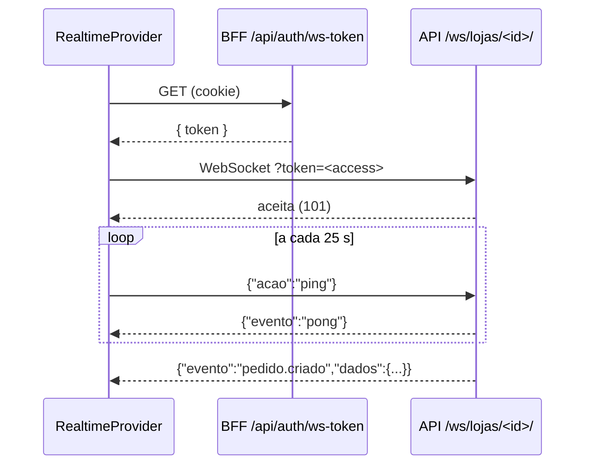

# Tempo real

A API publica eventos por **Django Channels com WebSocket nativo**. Não é Socket.io: use o `WebSocket` do navegador, sem cliente Socket.io.

## Peças

| Arquivo                                          | Papel                                                                |
| ------------------------------------------------ | -------------------------------------------------------------------- |
| `src/lib/realtime/realtime-client.ts`            | cliente: conexão, ping, reconexão com backoff                        |
| `src/components/providers/realtime-provider.tsx` | abre o canal da filial e transforma eventos em invalidações e avisos |
| `src/store/realtime-store.ts`                    | status da conexão e horário do último evento                         |
| `src/components/layout/connection-status.tsx`    | indicador "Tempo real ativo/inativo" no topo                         |
| `src/types/realtime.ts`                          | nomes e formatos dos eventos                                         |
| `src/app/api/auth/ws-token/route.ts`             | entrega o access token para abrir a conexão                          |

## Conexão

- **Canal:** `NEXT_PUBLIC_WS_URL` + `/ws/lojas/<lojaId>/`.
- **Filial:** a efetiva do usuário (`resolveLojaId`). Funcionários usam a própria filial. O ADMIN usa a escolhida no topo; **sem escolha, o painel não conecta** (status `idle`), porque não há canal "todas as filiais".
- **Autenticação:** o token vai em `?token=`, porque o navegador não envia cabeçalhos customizados no handshake.
- **Origem:** a API usa `AllowedHostsOriginValidator`, então o `Origin` do navegador precisa estar entre os hosts permitidos da API (`DJANGO_ALLOWED_HOSTS`).

## Status da conexão

| Status         | Quando                                                      |
| -------------- | ----------------------------------------------------------- |
| `idle`         | sem filial definida (ADMIN sem escolha)                     |
| `connecting`   | primeira tentativa                                          |
| `open`         | conectado                                                   |
| `reconnecting` | caiu; vai tentar de novo                                    |
| `forbidden`    | a API recusou o acesso à filial (`4403`); não tenta de novo |
| `closed`       | desconexão intencional ou sem sessão                        |

## Reconexão

- Atraso exponencial: 1 s, 2 s, 4 s... até no máximo 30 s. Volta para 1 s quando a conexão abre.
- Cada tentativa pede um token novo em `/api/auth/ws-token`. Se o access expirou, o pedido renova a sessão.
- `4401` (token inválido ou expirado): reconecta, com token renovado.
- `4403` (sem acesso à filial): para de tentar.
- `1000` (fechamento normal): não reconecta.

> Se o log do `next dev` mostra `GET /api/auth/ws-token` a cada ~10 s, a conexão está caindo e reconectando em loop. Veja [Solução de problemas](solucao-de-problemas.md#get-apiauthws-token-a-cada-10-segundos).

## Eventos

Todas as mensagens têm o formato `{"evento": string, "dados": object}`. Mensagens desconhecidas são ignoradas.

| Evento                     | Dados                                                        | Reação do painel                                                   |
| -------------------------- | ------------------------------------------------------------ | ------------------------------------------------------------------ |
| `pedido.criado`            | `pedido_id`, `codigo`, `status`                              | invalida `pedidos`, `separacoes`, `relatorios` e mostra um aviso   |
| `pedido.atualizado`        | `pedido_id`, `codigo`, `status`                              | invalida `pedidos`, `separacoes`, `relatorios`                     |
| `estoque.atualizado`       | `estoque_id`, `produto_id`, `quantidade`, `abaixo_do_minimo` | invalida `estoques`, `relatorios`; avisa se ficou abaixo do mínimo |
| `estoque.abaixo_do_minimo` | idem                                                         | invalida `estoques`, `relatorios` e avisa                          |
| `pong`                     | `{}`                                                         | nada (só mantém a conexão viva)                                    |

As invalidações ficam em `REALTIME_INVALIDATIONS` (`src/lib/query-keys.ts`). Invalidar um domínio refaz todas as consultas abertas daquele recurso, e as telas se atualizam sozinhas.

`pedido.atualizado` também é publicado a cada item marcado no checklist da separação.

## Como adicionar um evento

1. Confirme na API (`apps/core/realtime.py` e os serviços que publicam) o nome e os dados do evento.
2. Adicione o nome em `REALTIME_EVENTS` e o formato em `RealtimeMessage` (`src/types/realtime.ts`).
3. Trate o evento no `switch` do `RealtimeProvider`. Em geral, basta invalidar os domínios afetados (crie uma entrada em `REALTIME_INVALIDATIONS` se for um grupo novo).
4. Se o evento mostrar um aviso, adicione o texto em `realtime` no `src/messages/pt-BR.json`.
5. Teste o parser em `tests/unit/lib/realtime-client.test.ts`.

## Requisitos no backend

- O canal usa o Redis da API como _channel layer_ (`channels_redis`). Sem `REDIS_URL`, a API usa a camada em memória, que só funciona com um processo.
- A API precisa rodar com servidor ASGI (Daphne). O `manage.py runserver` já usa o Daphne, porque `daphne` está em `INSTALLED_APPS`.
- O limite de leitura do Redis (`CHANNEL_LAYER_SOCKET_TIMEOUT`, padrão 15 s) precisa ser maior que os 5 s de bloqueio do `channels_redis`. Com o `redis-py` 8, que desiste em 5 s por padrão, a conexão caía com o código `1011`.
